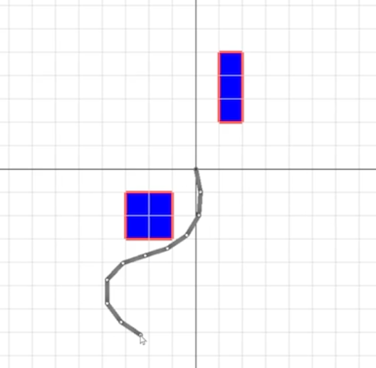

This project explored the optimization function used in inverse kinematics as a way to avoid collisions against in-map objects. The following is a quick video going over the project. 

<iframe width="560" height="315" src="https://www.youtube.com/embed/NSNKxwvfR6E?si=FEgRv_R0RcsO8tY2" title="YouTube video player" frameborder="0" allow="accelerometer; autoplay; clipboard-write; encrypted-media; gyroscope; picture-in-picture; web-share" allowfullscreen></iframe>

The project aimed to expand upon the inverse kinematics (IK) assignment from the 2023 TAMU CSCE Computer Animations course (Sueda) by creating a system of collision avoidance. The essence of it was implementing a real-time check during each Broyden–Fletcher–Goldfarb–Shanno (BFGS) optimization that happens when the user moves the mouse to affect the inverse kinematics by adding a penalty to the cost whenever a link passed into an object and its subsequent space. 

This was the implementation process - first a grid needed to be created that mirrored the objects that were placed on the field. Then, spaces with objects reflected in the grid needed to be marked as 'occupied'. During the optimization process, if a calculated position for each link in the chain (recalculated with forward kinematics) was on one of those occupied grid space (and thus colliding) a penalty would be added to the overall calculation. Receiving a high penalty and cost, the optimizer would attempt to find a different position.

Although not widely accurate, many changes and optimizations could be made to improve the end result or expand the project. Here are a few:
- Increasing grid size and detail for better collision checking
- Changing penalties based on position in a grid cell rather than a blanket penalty overall
- Experimentation with:
    - Different hyperparameters (iterations, alphas, thresholds, etc.)
    - Different optimzation models (BFGS, Newton's, etc.)
    - Different link lengths
    - Moving objects and updating
- Periodic recalculation of optimization, even when not moving
- Adaptive learning rates

